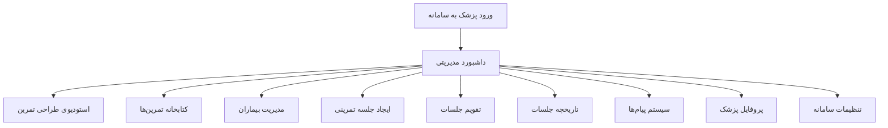
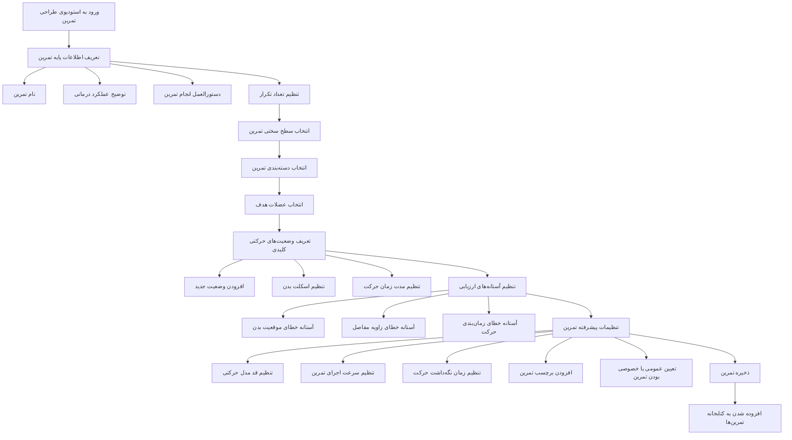
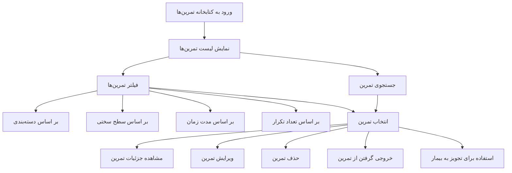
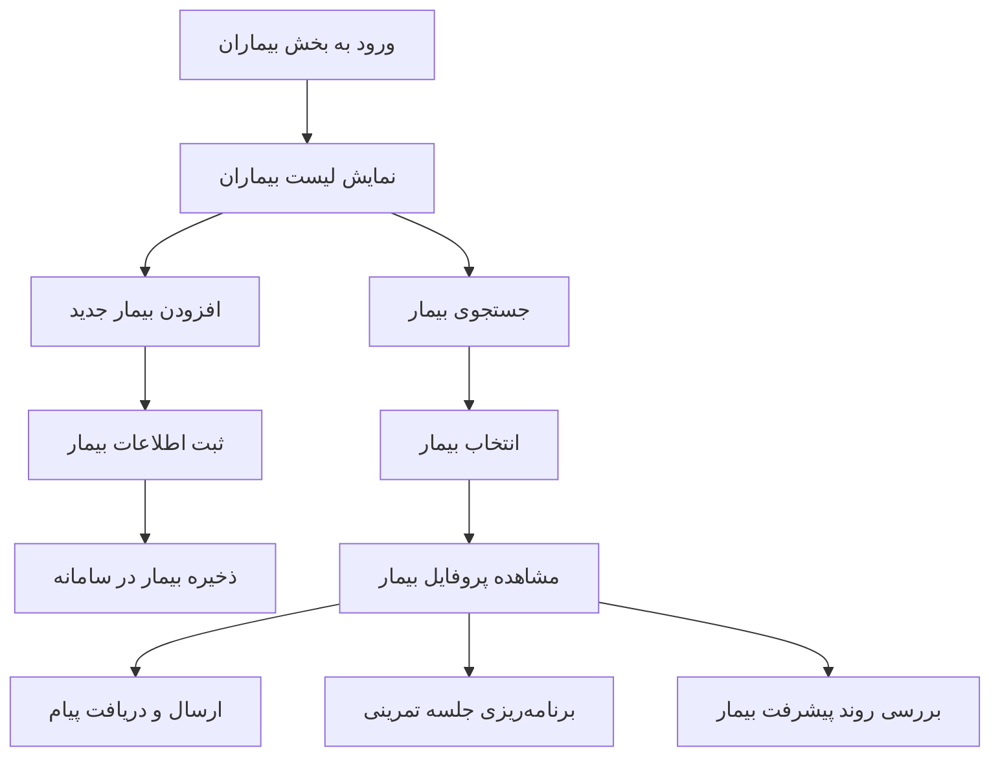
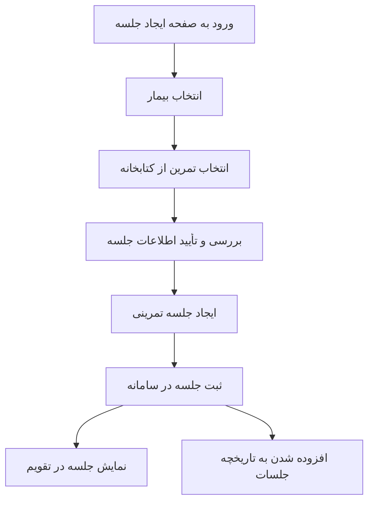
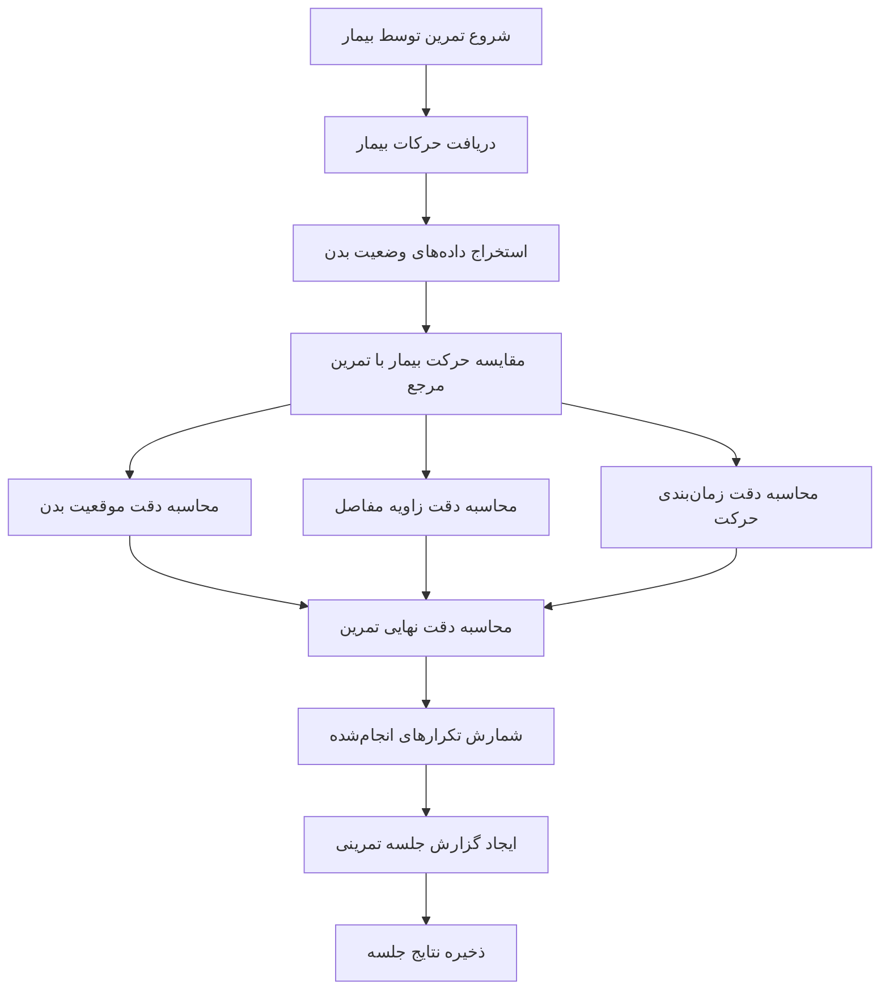
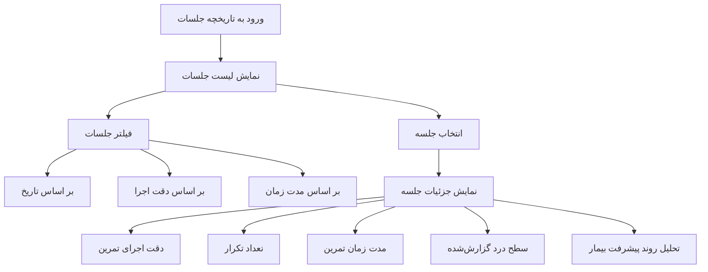
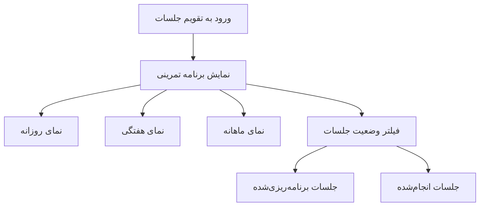
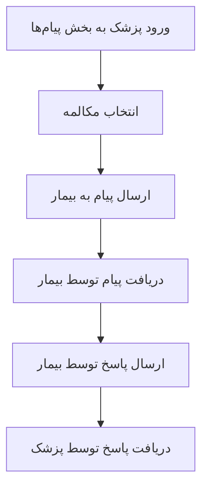
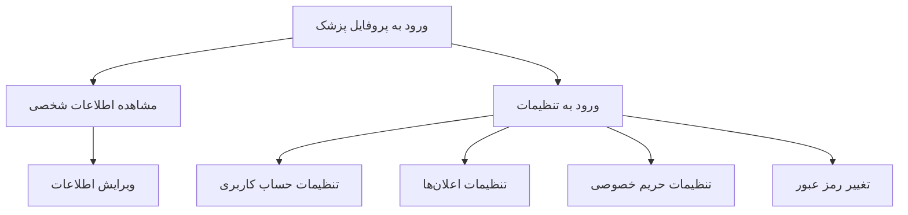

## ۱️⃣ نمودار جریان کلی سامانه (نمای کلان سیست

---

## ۲️⃣ نمودار کامل طراحی تمرین (Exercise Studio)

---

## ۳️⃣ نمودار مدیریت کتابخانه تمرین‌ها

---

## ۴️⃣ نمودار مدیریت بیماران

---

## ۵️⃣ نمودار ایجاد جلسه تمرینی

---

## ۶️⃣ نمودار اجرای تمرین و ارزیابی بیمار

---

## ۷️⃣ نمودار تحلیل جلسات تمرینی

---

## ۸️⃣ نمودار تقویم جلسات

---

## ۹️⃣ نمودار ارتباط پزشک و بیمار (پیام‌ها)

---

## 🔟 نمودار پروفایل و تنظیمات

